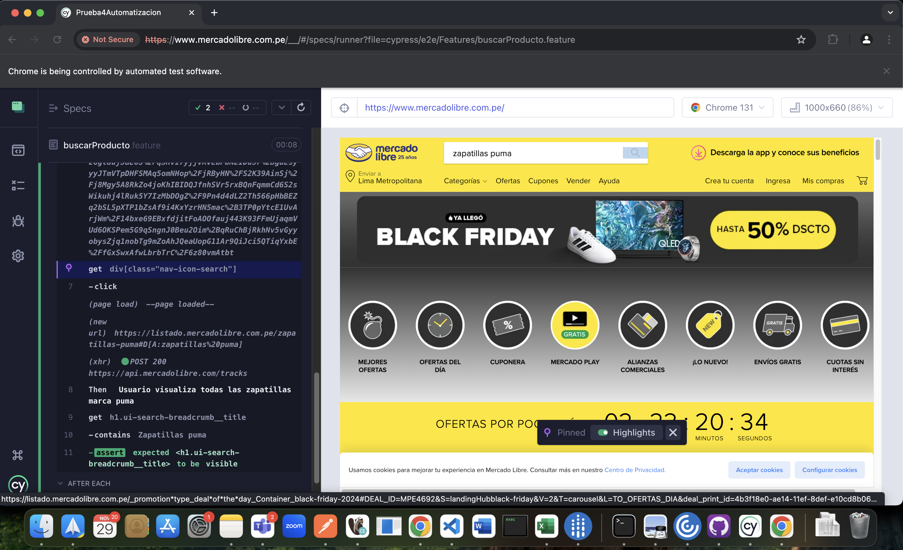
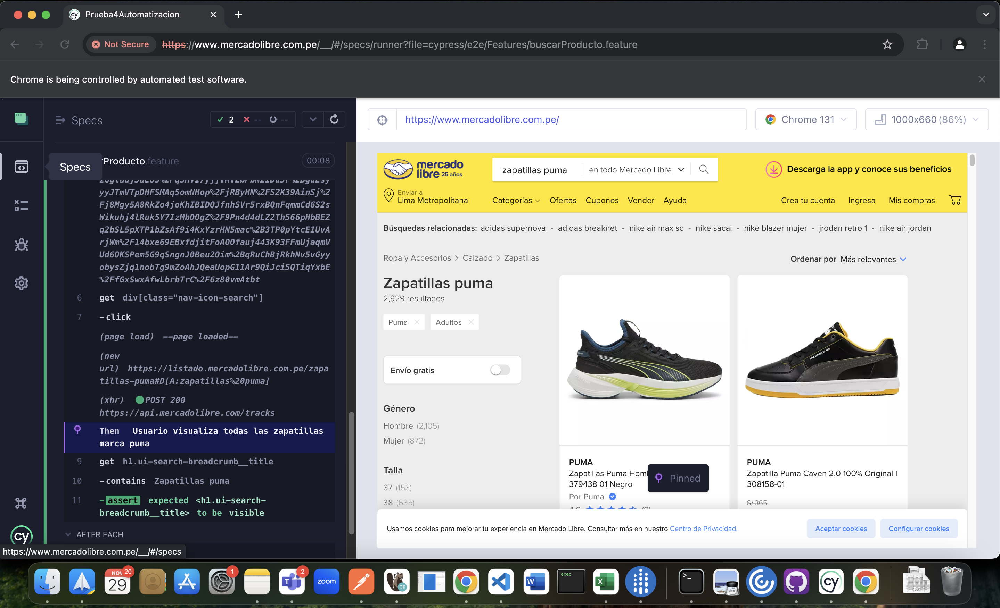
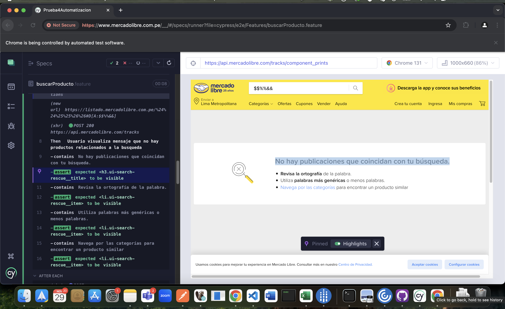

# Documentación del Proyecto de Automatización de Pruebas con Cypress

Este proyecto tiene como objetivo la automatización de pruebas funcionales para la página web de Mercado Libre utilizando el framework **Cypress** y el patrón de diseño **Page Object Model (POM)**. Los escenarios de prueba están escritos en **Gherkin** y se enlazan con el código JavaScript a través de **Cucumber**.


## Casos de Prueba Ejemplificados

### Feature: Buscar un Producto en Mercado Libre

### Escenario 1: Buscar un producto por el buscador de Mercado Libre

**Descripción:**
Se verifica que al ingresar "zapatillas puma" en el buscador, se muestren los productos relacionados.

**Implementación:**
* **Flujo:**
  1. El usuario abre la página principal de Mercado Libre.
  2. Ingresa "zapatillas puma" en el campo de búsqueda.
  3. Se valida que los resultados de la búsqueda correspondan a productos de la marca Puma.

  **Evidencia de la ejecución**

  
  
  

### Escenario 2: Buscar producto con caracteres especiales

**Descripción:**
Se verifica que al ingresar una cadena con caracteres especiales, se muestre un mensaje indicando que no hay resultados.

**Implementación:**
* **Flujo:**
  1. El usuario abre la página principal de Mercado Libre.
  2. Ingresa una cadena con caracteres especiales (e.g., "$$%%&&") en el campo de búsqueda.
  3. Se valida que se muestre un mensaje de "No se encontraron resultados".

**Evidencia de la ejecución**

  
  
  

## Herramientas Utilizadas
- Visual Studio Code
- Cypress
- Google Chrome
## Estructura del Proyecto

El proyecto está organizado en tres carpetas principales:

1. **Features**
   - Esta carpeta contiene los escenarios de prueba escritos en **lenguaje Gherkin**. Cada archivo representa un conjunto de escenarios relacionados con una funcionalidad específica.
   - Ejemplo:
     - `buscarProducto.feature`

2. **Pages**
   - En esta carpeta se encuentran los elementos y las interacciones específicas para cada página de la web. La carpeta sigue el patrón **Page Object Model (POM)**, donde cada página de la web tiene una clase con métodos que representan acciones o verificaciones posibles en esa página.
   - Ejemplo:
     - `CatalogoProductoPage.js`
     - `ErrorMensajePage.js`
     - `HomeMercadoLibrePage.js`

3. **Step-Definitions**
   - En esta carpeta se encuentran los pasos de prueba escritos en **JavaScript** que hacen match con los pasos definidos en los escenarios de Gherkin. Esta capa es responsable de la implementación de la lógica para cada paso de los escenarios.
   - Ejemplo:
     - `MercadoLibreStep.js`

## Flujo de Trabajo para Ejecutar el Proyecto

1. **Configuración del Proyecto**
   - Cuando descargues el proyecto desde GitHub, debes ejecutar el siguiente comando para instalar las dependencias necesarias:

     ```bash
     npm init
     ```

   - Este comando descargará todas las librerías y dependencias requeridas, como Cypress, Cucumber, y otros módulos necesarios para la ejecución de los tests.

2. **Ejecutar los Casos de Prueba**
   - Una vez que las dependencias estén instaladas, puedes ejecutar los casos de prueba utilizando el siguiente comando:

     ```bash
     npx cypress open
     ```

   - Esto abrirá la interfaz de usuario de Cypress y luego tienes que hacer los siguiente pasos:
   1. Escoger la opcion 'E2E Testing'
   2. Escoger el navegador de tu preferencia, recomendable usar Google Chrome
   3. Hacer Click en el boton 'Start E2E Testing in Chrome'
   4. Hacer click al archivo MercadoLibre.feature
   5. Se ejecutaran los casos automaticamente